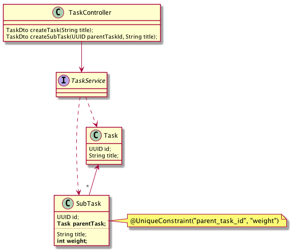

:toc: preamble

# StressTest

image:https://travis-ci.com/jupiter-tools/stress-test.svg?branch=master["Build Status", link="https://travis-ci.com/jupiter-tools/stress-test"]
image:https://codecov.io/gh/jupiter-tools/stress-test/branch/master/graph/badge.svg[link ="https://codecov.io/gh/jupiter-tools/stress-test"]

Tools which wrap the MockMvc in a simple matcher of HTTP responses,
to write your REST-API tests in a more easy way.

## Getting started

You need to add a next dependency:

[source, xml]
----
<dependency>
    <groupId>com.jupiter-tools</groupId>
    <artifactId>stress-test</artifactId>
    <version>0.1</version>
</dependency>
----

## Stress testing REST API

Let's consider a simple web application :

Here we can create tasks and sub-tasks with titles,
estimates, and weights(position in the list).
When we create a sub-task we need to evaluate weight
and set the next value for creating the task,
because exists a unique constraint on the SubTask table in the database.

If we don't synchronize API then multiple concurrent requests
might let us to ConstraintViolationException.

In this case, StressTestRunner provide you an ability to check synchronization of your API:

[source, java]
----
@Test
void concurrentThreadsSubTasks() {
    ConcurrentTestRunner.test()
                        .mode(ExecutionMode.TASK_EXECUTOR_MODE)  <1>
                        .timeout(5, TimeUnit.SECONDS) <2>
                        .threads(4)   <3>
                        .iterations(100)  <4>
                        .run(this::createSubTaskSingleTest); <5>
}

private void createSubTaskSingleTest() throws Exception {

    SubTask subTask = MvcRequester.on(mockMvc)
                                  .to("tasks/{id}/subtasks/create", TASK_ID)
                                  .withParam("title", "Make it safe!")
                                  .withParam("estimate", 30)
                                  .post()
                                  .expectStatus(HttpStatus.CREATED)
                                  .returnAs(SubTask.class);

    assertThat(subTask).isNotNull()
                       .extracting(SubTask::getTitle, SubTask::getEstimate)
                       .contains("Make it safe!", 30);
}
----
<1> test runner strategy (ThreadPoolExecutor based or Parallel Stream based)
<2> time limit for tests passing
<3> set threads count
<4> set count of runs.
<5> code of the one test iteration

## JUnit5 Benchmark Extension

When you need to compare a performance of multiple methods, you can use
TestBenchmark extension:

[source, java]
----
@EnableTestBenchmark  <1>
class EnableTestBenchmarkTest {

    @Fast <2>
    @TestBenchmark(measurementIterations = 15, warmupIterations = 10)  <3>
    void testFast() throws InterruptedException {
        Thread.sleep(30);
    }

    @TestBenchmark(measurementIterations = 15, warmupIterations = 10)
    void testSlow() throws InterruptedException {
        Thread.sleep(100);
    }
}
----
<1> enable test extension
<2> mark as Fast method which you expect will be faster
<3> set measurement and warm-up iterations

If you measuring very fast methods (less than one milliseconds)
you can use `MeasureUnit` annotation to set a unit of measurement profiling:

[source, java]
----
@EnableTestBenchmark
@MeasureUnit(unit = TimeUnit.NANOSECONDS)
class BenchmarkExtensionMeasureUnitTest {

    @Fast
    @TestBenchmark(measurementIterations = 15, warmupIterations = 10)
    void testFast() {
    }

    @TestBenchmark(measurementIterations = 15, warmupIterations = 10)
    void testSlow() throws InterruptedException {
        Thread.sleep(1);
    }
}
----